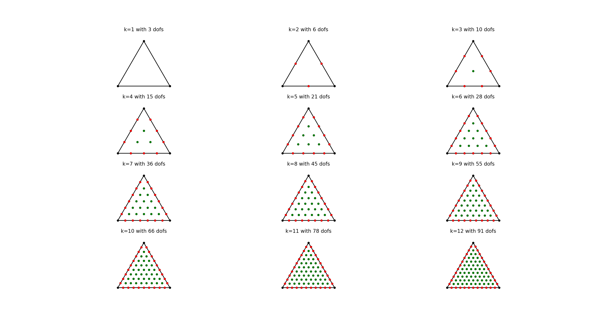

# 三角形单元上的任意次 Lagrangian 基函数

| 记号 | 意义|
|:----- | :-----|
| $$\tau$$ | 三角形单元 |
| $$x_i, i= 1, 2, 3$$ | $$\tau$$ 的三个顶点 |
| $$e_{ij}$$ |以 $x_i$ 和 $$x_j$$ 为顶点的边 |
| $$\lambda_i, i =1, 2, 3$$ | 三个顶点对应的重心坐标 |
| $$ \mathrm{dof}_p = \frac{(p+1)(p+2)}{2}$$ | $$p$$ 次多项式的自由度个数 |

顶点 $$x_i$$ 上的基函数:
$$
\phi_i = \frac{p^{p}}{p!}\prod_{l=0}^{p-1}
(\lambda_i - \frac{l}{p}), 
$$
其中 $$i = 1, 2, ,3$$.

边 $$e_{ij}$$ 上的基函数: 
$$
\phi_{ij, m} = \frac{p^p}{m!(p-m)!}
\prod_{l_1 = 0}^{m-1}(\lambda_i  - \frac{l_1}{p})
\prod_{l_2 = 0}^{p-m-1}(\lambda_j - \frac{l_2}{p}),
$$
其中 $$1 < i, j < 3, i \not= j$$

单元 $$\tau$$ 内部自由度的基函数:
$$
\phi_{ijk,m,n} = \frac{p^p}{m!n!(p-m-n)!}\prod_{l_1 = 0}^{m - 1}
(\lambda_i - \frac{l_1}{p}) \prod_{l_2 = 0}^{n-1}(\lambda_j -
\frac{l_2}{p}) \prod_{l_3=0}^{p-m-n-1}(\lambda_k - \frac{l_3}{p}).
$$

## 给重心坐标处的基函数值

给定一个重心坐标点 
$$
b = 
\begin{pmatrix}
\lambda_1 & \lambda_2 & \lambda_3
\end{pmatrix}
$$

如何利用矩阵的方式计算出所有自由度对应基函数的函数值及梯度值?

首先, 计算出一些系数常量:
$$
c = 
\begin{pmatrix}
\frac{1}{1!} &  \frac{1}{2!} & \cdots & \frac{1}{p!}
\end{pmatrix},\quad 
$$

$$
P = 
\begin{pmatrix}
\frac{1}{1!} & 0 & \cdots & 0\\
0 & \frac{1}{2!} & \cdots & 0\\
\vdots & \vdots & \ddots & 0 \\
0 & 0 & \cdots & \frac{1}{p!}
\end{pmatrix}
$$

$$
A := 
\begin{pmatrix}
\lambda_1 & \lambda_2 & \lambda_3\\
\lambda_1 - \frac{1}{p} & \lambda_2 - \frac{1}{p} & \lambda_2 - \frac{1}{p}\\
\vdots & \vdots & \vdots \\
\lambda_1 - \frac{p - 1}{p} & \lambda_2 - \frac{p - 1}{p} & \lambda_2 - \frac{p - 1}{p}
\end{pmatrix}
$$

$$
B = P 
\begin{pmatrix}
\lambda_1 & \lambda_2 & \lambda_3\\
\prod_{l=0}^{1}(\lambda_1 - \frac{l}{p}) & \prod_{l=0}^{1}(\lambda_2 - \frac{l}{p})
& \prod_{l=0}^{1}(\lambda_3 - \frac{l}{p}) \\
\vdots & \vdots & \vdots \\
\prod_{l=0}^{p-1}(\lambda_1 - \frac{l}{p}) & \prod_{l=0}^{p-1}(\lambda_2 - \frac{l}{p})
& \prod_{l=0}^{p-1}(\lambda_3 - \frac{l}{p}) 
\end{pmatrix}
$$

顶点处的基函数值为 $$B$$ 的第 $$p$$ 行: 

$$
\Phi_v =  p^pB(p, :)
$$

构造矩阵 $$ C = B(1:p-1, [2, 3, 1]) $$, $$ D = B(p-1:-1:1, [3, 1, 2])$$

$$
\Phi_e = p^p C\circ D
$$

取 $$B$$ 的前面 $$p-2$$ 行, 取三列分别构造 $$M_1, M_2$$ 和 $$M_3$$:

$$
M_1 = \begin{pmatrix}
\lambda_1 & 0 & \cdots & 0 \\
0 & \frac{1}{2!}\prod_{l=0}^1(\lambda_1 - \frac{l}{p}) & \cdots & 0 \\
\vdots & \vdots & \ddots & \vdots \\
0 & 0 & \cdots & \frac{1}{(p-1)!}\prod_{l=0}^{p-2}(\lambda_1 - \frac{l}{p})
\end{pmatrix}
$$

$$
M_2 = 
\begin{pmatrix}
\lambda_2  & \frac{1}{(p-1)!}\prod_{l=0}^{p-2}(\lambda_2 - \frac{l}{p}) & \cdots &
\frac{1}{2!}\prod_{l=0}^1(\lambda_2 - \frac{l}{p}) \\
\frac{1}{2!}\prod_{l=0}^1(\lambda_2 - \frac{l}{p})& \lambda_2 & \cdots &
\frac{1}{2!}\prod_{l=0}^2(\lambda_2 - \frac{l}{p}) \\
\vdots & \vdots & \ddots & \vdots\\
\frac{1}{(p-1)!}\prod_{l=0}^{p-2}(\lambda_2 - \frac{l}{p}) & 
\frac{1}{(p-2)!}\prod_{l=0}^{p-3}(\lambda_2 -
\frac{l}{p}) & \cdots & \lambda_2 
\end{pmatrix}
$$

$$
M_3 = \begin{pmatrix}
\frac{1}{(p-1)!}\prod_{l=0}^{p-2}(\lambda_3 - \frac{l}{p}) & \frac{1}{(p-1)!}\prod_{l=0}^{p-2}(\lambda_3 - \frac{l}{p})
& \cdots & \frac{1}{(p-1)!}\prod_{l=0}^{p-2}(\lambda_3 - \frac{l}{p})\\ 
\frac{1}{(p-2)!}\prod_{l=0}^{p-3}(\lambda_3 - \frac{l}{p}) & \frac{1}{(p-2)!}\prod_{l=0}^{p-3}(\lambda_3 - \frac{l}{p})
& \cdots & \frac{1}{(p-2)!}\prod_{l=0}^{p-3}(\lambda_3 - \frac{l}{p})\\ 
\vdots & \vdots & \ddots & \vdots \\
\lambda_3 & \lambda_3 & \cdots & \lambda_3
\end{pmatrix}
$$

写成矩阵形式:
$$
E = p^p(M_2 \circ M_3)M_1
$$

其中 $$\circ$$ 表示矩阵的 
[Hadamard 乘积](https://www.wikiwand.com/en/Hadamard_product_(matrices)),
即同维数的矩阵对应元素相乘. 然后取矩阵 $$E$$ 下三角矩阵,
即可得所有单元内部自由度处的基函数值.

## 函数值的递归算法

由图可知, 自由度的分布可以自成一个个相互嵌套的三角形的形式,因此可以构造如下的算法,

$$
A := 
\begin{pmatrix}
\lambda_1 & \lambda_2 & \lambda_3\\
\lambda_1 - \frac{1}{p} & \lambda_2 - \frac{1}{p} & \lambda_2 - \frac{1}{p}\\
\vdots & \vdots & \vdots \\
\lambda_1 - \frac{p - 1}{p} & \lambda_2 - \frac{p - 1}{p} & \lambda_2 - \frac{p - 1}{p}
\end{pmatrix}
$$
$$
P = 
\begin{pmatrix}
\frac{1}{1!} & 0 & \cdots & 0\\
0 & \frac{1}{2!} & \cdots & 0\\
\vdots & \vdots & \ddots & 0 \\
0 & 0 & \cdots & \frac{1}{p!}
\end{pmatrix}
$$

**Setp 1** 

$$
a_1 = 1
$$

$$ 
A_1:= A
$$

$$ A_1 $$ 按列累乘, 并左乘 $$P$$, 得

$$
B_1 = P 
\begin{pmatrix}
\lambda_1 & \lambda_2 & \lambda_3\\
\prod_{l=0}^{1}(\lambda_1 - \frac{l}{p}) & \prod_{l=0}^{1}(\lambda_2 - \frac{l}{p})
& \prod_{l=0}^{1}(\lambda_3 - \frac{l}{p}) \\
\vdots & \vdots & \vdots \\
\prod_{l=0}^{p-1}(\lambda_1 - \frac{l}{p}) & \prod_{l=0}^{p-1}(\lambda_2 - \frac{l}{p})
& \prod_{l=0}^{p-1}(\lambda_3 - \frac{l}{p}) 
\end{pmatrix}
$$

顶点处的基函数值为 $$B$$ 的第 $$p$$ 行: 

$$
\Phi_v =  p^pB(p, :)
$$

构造矩阵 $$ C = B(1:p-1, [2, 3, 1]) $$, $$ D = B(p-1:-1:1, [3, 1, 2])$$

$$
\Phi_e = p^p C\circ D
$$

**Step i**

$$ 
a_i = (\lambda_1-\frac{i-1}{p})(\lambda_2 - \frac{i-1}{p})(\lambda_3-\frac{i-1}{p})
$$

$$
b_i = b_{i-1}a_i
$$

$$
\nabla b_i = a_i\nabla b_{i-1} + b_{i-1} \nabla b_i
$$

从第 $$i$$ 行开始, 取 $$ p - 3(i-1)$$ 行, 记 $$j = i + p - 3(i - 1) -1$$, 
记 $$ A_i = A(i:j, :)$$, $$ P_i = P(i:j,:)$$  

$$A_i$$ 按列累乘, 左乘 $$P_i$$ 得到矩阵 $$B_i$$, 则, $$a_i$$ 乘以 $$B_i$$ 的最后一行, 即可得到 3 个新的基函数, 进而构造矩阵 $$C_i = B_i(1:end-1, [2, 3, 1])$$, $$D_i = B_i(end-1:-1:1, [3, 1, 2])$$, 则可得更多的基函数

$$
p^pb_iC_i\circ D_i
$$

## 给定重心坐标处的梯度值计算 

$$
\begin{pmatrix}
\nabla \lambda_1  & \nabla \lambda_2 & \nabla \lambda_3
\end{pmatrix}
$$

节点处基函数的梯度计算公式如下:  
$$
\phi_i^V = \frac{p^p}{p!}\sum_{k = 0}^{p-1}
\frac{\prod_{l=0}^{p-1}(\lambda_i - \frac{l}{p})}{\lambda_i - \frac{l}{p}}
\nabla \lambda_i
$$
但上面的计算公式不适用于浮点运算.可引入如下三个矩阵 $$F_i, i = 1, 2, 3$$: 

$$
F_i = 
\begin{pmatrix}
1 & \lambda_i & \cdots & \lambda_i \\
\lambda_i - \frac{1}{p} & 1 & \cdots & \lambda_i - \frac{1}{p} \\
\vdots & \vdots & \ddots & \vdots \\
\lambda_i - \frac{p-1}{p} & \lambda_i - \frac{p-1}{p} & \cdots & 1
\end{pmatrix}
$$

定义如下运算

$$
f_{i,j} = \sum_{m=1}^j\prod_{k=1}^j F_i(k, m),\quad i = 1, 2, 3, 1 \leq j \leq p-1.
$$

$$
\begin{aligned}
\nabla B = &  
P
\begin{pmatrix}
\nabla \lambda_1 & \nabla \lambda_2 & \nabla \lambda_3\\
\nabla \prod_{l=0}^{1}(\lambda_1 - \frac{l}{p}) & 
\nabla \prod_{l=0}^{1}(\lambda_2 - \frac{l}{p}) &
\nabla \prod_{l=0}^{1}(\lambda_3 - \frac{l}{p}) \\
\vdots & \vdots & \vdots \\
\nabla \prod_{l=0}^{p-1}(\lambda_1 - \frac{l}{p}) &
\nabla \prod_{l=0}^{p-1}(\lambda_2 - \frac{l}{p}) &
\nabla \prod_{l=0}^{p-1}(\lambda_3 - \frac{l}{p}) 
\end{pmatrix}\\
= & P
\begin{pmatrix}
\nabla \lambda_1 & \nabla \lambda_2 & \nabla \lambda_3\\
f_{1,1} \nabla \lambda_1 & 
f_{2,1} \nabla \lambda_2 &
f_{3,1} \nabla \lambda_3 \\
\vdots & \vdots & \vdots \\
f_{1, p-1} \nabla \lambda_1 &
f_{2, p-1} \nabla \lambda_2 &
f_{3, p-1} \nabla \lambda_3 
\end{pmatrix}\\
= & P
\begin{pmatrix}
1 & 1 & 1\\
f_{1,1} & 
f_{2,1} &
f_{3,1} \\
\vdots & \vdots & \vdots \\
f_{1, p-1} &
f_{2, p-1} &
f_{3, p-1}  
\end{pmatrix}
\begin{pmatrix}
\nabla \lambda_1 & 0 & 0\\
0 & \nabla \lambda_2 & 0 \\
0 & 0 & \nabla \lambda_3
\end{pmatrix}
\end{aligned}
$$

# 具体例子

## $$ p = 1$$ 

## $$ p = 2$$

## $$ p = 3$$
$$
\begin{aligned}
\phi_1 = & \frac{9}{2}\lambda_1(\lambda_1 - \frac{1}{3})(\lambda_1 - \frac{2}{3})\\
\phi_2 = & \frac{9}{2}\lambda_2(\lambda_2 - \frac{1}{3})(\lambda_2 - \frac{2}{3})\\
\phi_3 = & \frac{9}{2}\lambda_3(\lambda_3 - \frac{1}{3})(\lambda_3 - \frac{2}{3})\\
\phi_{23, 1} =& \frac{27}{2} \lambda_2(\lambda_2 - \frac{1}{3})\lambda_3 \\
\phi_{23, 2} =& \frac{27}{2} \lambda_2\lambda_3(\lambda_3 - \frac{1}{3}) \\
\phi_{31, 1} =& \frac{27}{2} \lambda_3(\lambda_3 - \frac{1}{3})\lambda_1 \\
\phi_{31, 2} =& \frac{27}{2} \lambda_3\lambda_1(\lambda_1 - \frac{1}{3}) \\
\phi_{12, 1} =& \frac{27}{2} \lambda_1(\lambda_1 - \frac{1}{3})\lambda_2 \\
\phi_{12, 2} =& \frac{27}{2} \lambda_1\lambda_2(\lambda_2 - \frac{1}{3}) \\
\phi_{123, 1} = & 27\lambda_1\lambda_2\lambda_3
\end{aligned}
$$

## $$ p = 4 $$

$$
\begin{aligned}
\phi_1 = & \frac{4^3}{3!}\lambda_1(\lambda_1 - \frac{1}{4})(\lambda_1-
\frac{2}{4})(\lambda_1 - \frac{3}{4})\\
\phi_2 = & \frac{4^3}{3!}\lambda_2(\lambda_2 - \frac{1}{4})(\lambda_2-
\frac{2}{4})(\lambda_2 - \frac{3}{4})\\
\phi_3 = & \frac{4^3}{3!}\lambda_3(\lambda_3 - \frac{1}{4})(\lambda_3-
\frac{2}{4})(\lambda_3 - \frac{3}{4})\\

\phi_{23,1} = & \frac{4^4}{3!1!}\lambda_2(\lambda_2 - \frac{1}{4})(\lambda_2 - \frac{2}{4})
\lambda_3\\
\phi_{23,2} = & \frac{4^4}{2!2!}\lambda_2(\lambda_2 - \frac{1}{4})\lambda_3
(\lambda_3 - \frac{1}{4}) \\
\phi_{23,3} = & \frac{4^4}{1!3!}\lambda_2\lambda_3(\lambda_3 - \frac{1}{4})(\lambda_3 -
\frac{2}{4})\\

\phi_{31,1} = & \frac{4^4}{3!1!}\lambda_3(\lambda_3 - \frac{1}{4})(\lambda_3 - \frac{2}{4})
\lambda_1\\
\phi_{31,2} = & \frac{4^4}{2!2!}\lambda_3(\lambda_3 - \frac{1}{4})\lambda_1
(\lambda_1 - \frac{1}{4}) \\
\phi_{31,3} = & \frac{4^4}{1!3!}\lambda_3\lambda_1(\lambda_1 - \frac{1}{4})(\lambda_1 -
\frac{2}{4})\\

\phi_{12,1} = & \frac{4^4}{3!1!}\lambda_1(\lambda_1 - \frac{1}{4})(\lambda_1 - \frac{2}{4})
\lambda_2\\
\phi_{12,2} = & \frac{4^4}{2!2!}\lambda_1(\lambda_1 - \frac{1}{4})\lambda_2
(\lambda_2 - \frac{1}{4}) \\
\phi_{12,3} = & \frac{4^4}{1!3!}\lambda_1\lambda_2(\lambda_2 - \frac{1}{4})(\lambda_2 -
\frac{2}{4})\\

\phi_{123, 1} = &\frac{4^4}{2!1!1!} \lambda_1(\lambda_1 - \frac{1}{4})\lambda_2\lambda_3\\
\phi_{123, 2} = & \frac{4^4}{1!2!1!}\lambda_1\lambda_2(\lambda_2 - \frac{1}{4})\lambda_3\\
\phi_{123, 3} = & \frac{4^4}{1!1!2!}\lambda_1\lambda_2\lambda_3(\lambda_3 - \frac{1}{4})
\end{aligned}
$$
